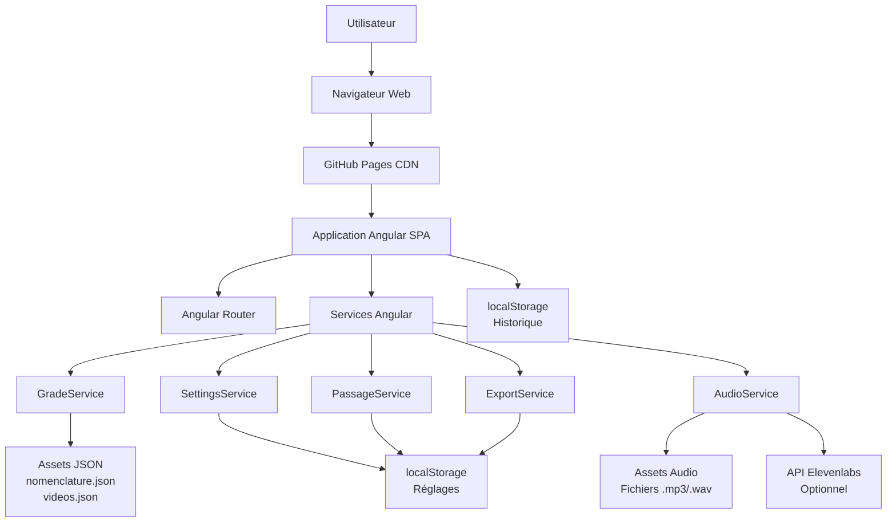
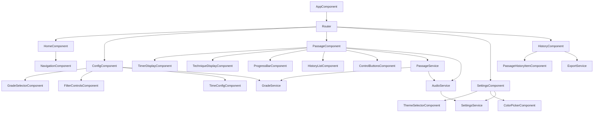
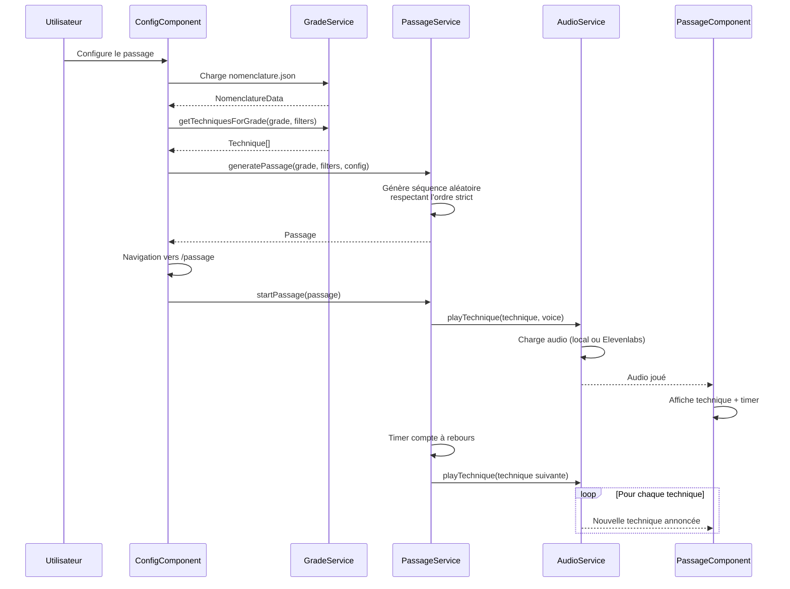
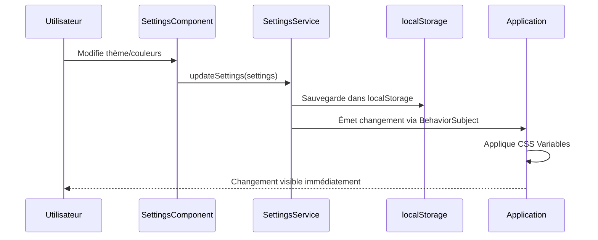
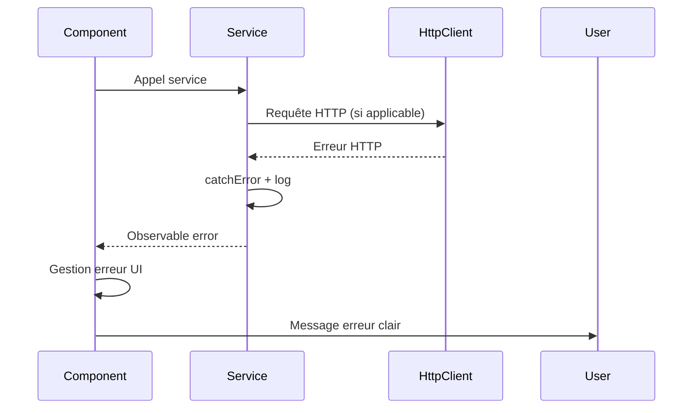

# Keiko Hub Fullstack Architecture Document

**Version:** 1.0  
**Date:** 2024-12-19  
**Auteur:** Architect (Winston)

---

## Introduction

Ce document décrit l'architecture technique complète de **Keiko Hub**, une application web Angular SPA (Single Page Application) fonctionnant entièrement côté client. Cette architecture unifiée guide le développement AI-driven, garantissant la cohérence sur l'ensemble de la stack technologique.

Cette application étant une SPA purement frontend (sans backend), l'architecture se concentre sur l'organisation du code Angular, la gestion d'état, les services, et les stratégies de déploiement statique.

### Starter Template or Existing Project

**N/A - Greenfield project**

Projet Angular créé à partir de zéro avec Angular CLI. Pas de template starter spécifique utilisé, structure Angular standard.

### Change Log

| Date | Version | Description | Author |
|------|---------|-------------|--------|
| 2024-12-19 | 1.0 | Création initiale de l'architecture | Winston (Architect) |

---

## High Level Architecture

### Technical Summary

**Keiko Hub** est une application web Angular SPA (Single Page Application) déployée comme site statique sur GitHub Pages. L'architecture est entièrement côté client, sans backend ni serveur. L'application utilise Angular avec RxJS pour la gestion d'état réactive, charge des fichiers JSON statiques depuis les assets pour les données des grades et vidéos, et utilise localStorage pour la persistance des réglages utilisateur et de l'historique. L'intégration optionnelle avec l'API Elevenlabs pour la synthèse vocale se fait directement depuis le navigateur. Cette architecture simple et légère répond aux objectifs du PRD : application gratuite, accessible, fonctionnant sans infrastructure serveur, et optimisée pour une utilisation mobile pendant l'entraînement physique.

### Platform and Infrastructure Choice

**Platform:** GitHub Pages (Static Site Hosting)

**Key Services:**
- **GitHub Pages:** Hébergement statique gratuit pour l'application Angular compilée
- **GitHub Actions (optionnel):** CI/CD pour build et déploiement automatique
- **GitHub Repository:** Version control et collaboration

**Deployment Host and Regions:** GitHub Pages CDN global (multi-régions automatiques)

**Rationale:**
- **Budget zéro:** GitHub Pages est gratuit pour les repositories publics
- **Simplicité:** Pas d'infrastructure complexe nécessaire pour une SPA statique
- **Performance:** CDN global de GitHub pour distribution rapide
- **Intégration:** Workflow Git simple pour déploiement
- **HTTPS:** Certificat SSL automatique inclus

**Alternatives considérées:**
- **Vercel/Netlify:** Offrent des fonctionnalités similaires mais GitHub Pages est suffisant et déjà intégré au workflow Git
- **AWS S3 + CloudFront:** Trop complexe et coûteux pour cette application simple

### Repository Structure

**Structure:** Monorepo Angular standard (pas de monorepo tool externe nécessaire)

**Monorepo Tool:** N/A - Structure Angular standard suffisante

**Package Organization:**
```
keiko-hub/
├── src/                          # Code source Angular
│   ├── app/                      # Application principale
│   │   ├── components/          # Composants UI
│   │   ├── pages/               # Pages/Composants de route
│   │   ├── services/            # Services Angular
│   │   ├── models/              # Interfaces TypeScript
│   │   ├── guards/              # Route guards (si nécessaire)
│   │   ├── interceptors/         # HTTP interceptors (si nécessaire)
│   │   └── utils/               # Utilitaires
│   ├── assets/                  # Assets statiques
│   │   ├── data/                # Fichiers JSON (nomenclature.json, videos.json)
│   │   ├── audio/               # Fichiers audio pré-enregistrés
│   │   └── images/              # Images (logo, etc.)
│   ├── styles/                  # Styles globaux
│   └── environments/            # Configuration par environnement
├── docs/                         # Documentation
│   ├── prd.md
│   ├── front-end-spec.md
│   └── architecture.md
├── e2e/                          # Tests E2E (optionnel pour MVP)
├── angular.json                  # Configuration Angular
├── package.json                  # Dépendances
└── tsconfig.json                 # Configuration TypeScript
```

**Rationale:** Structure Angular standard, simple et maintenable. Pas besoin de monorepo tool complexe pour une application SPA unique. La structure est claire et suit les conventions Angular.

### High Level Architecture Diagram



### Architectural Patterns

- **SPA (Single Page Application):** Application Angular avec routing côté client - _Rationale:_ Expérience utilisateur fluide, navigation rapide sans rechargements de page, idéal pour une application interactive
- **Component-Based Architecture:** Composants Angular réutilisables et modulaires - _Rationale:_ Maintenabilité, réutilisabilité, séparation des responsabilités, facilité de test
- **Service-Oriented Architecture (Frontend):** Services Angular pour la logique métier - _Rationale:_ Séparation claire entre logique métier et présentation, services réutilisables, testabilité
- **Reactive State Management:** RxJS BehaviorSubject pour l'état réactif - _Rationale:_ Communication réactive entre composants, gestion d'état centralisée sans complexité de NgRx, adapté à la taille de l'application
- **Static Asset Loading:** Chargement asynchrone des fichiers JSON et audio depuis assets - _Rationale:_ Pas de backend nécessaire, données statiques, performance optimale avec cache navigateur
- **Client-Side Persistence:** localStorage pour réglages et historique - _Rationale:_ Pas de backend nécessaire, persistance locale, simple et efficace pour les besoins de l'application

---

## Tech Stack

### Technology Stack Table

| Category | Technology | Version | Purpose | Rationale |
|----------|------------|---------|---------|------------|
| Frontend Language | TypeScript | 5.x (compatible Angular) | Typage statique pour le code Angular | Sécurité de type, meilleure DX, compatibilité Angular |
| Frontend Framework | Angular | LTS (18+) | Framework principal pour SPA | Framework mature, routing intégré, services, animations, communauté active |
| UI Component Library | Custom Components | N/A | Composants personnalisés | Pas de framework CSS externe pour contrôle total du design et performance |
| State Management | RxJS | Inclus avec Angular | Gestion d'état réactive | BehaviorSubject pour état réactif, pas besoin de NgRx pour cette taille d'application |
| Backend Language | N/A | N/A | Pas de backend | Application 100% côté client |
| Backend Framework | N/A | N/A | Pas de backend | Application 100% côté client |
| API Style | N/A | N/A | Pas d'API backend | Application 100% côté client |
| Database | N/A | N/A | Pas de base de données | localStorage pour persistance locale |
| Cache | Browser Cache | N/A | Cache navigateur pour assets | Cache HTTP standard, pas de cache serveur nécessaire |
| File Storage | GitHub Pages Assets | N/A | Stockage fichiers statiques | Fichiers JSON et audio dans assets/, servis par GitHub Pages |
| Authentication | N/A | N/A | Pas d'authentification | Application publique, pas de comptes utilisateur |
| Frontend Testing | Jasmine + Karma | Inclus Angular | Tests unitaires | Framework de test standard Angular, intégré |
| Backend Testing | N/A | N/A | Pas de backend | Application 100% côté client |
| E2E Testing | Protractor/Cypress | Optionnel | Tests end-to-end | Optionnel pour MVP, peut être ajouté post-MVP |
| Build Tool | Angular CLI | LTS | Build et développement | Outil officiel Angular, optimisé pour Angular |
| Bundler | Webpack (via Angular CLI) | Inclus | Bundling du code | Configuré automatiquement par Angular CLI |
| IaC Tool | N/A | N/A | Pas d'infrastructure | Déploiement statique simple, pas d'IaC nécessaire |
| CI/CD | GitHub Actions | Optionnel | Build et déploiement automatique | Optionnel pour MVP, déploiement manuel acceptable |
| Monitoring | N/A | N/A | Pas de monitoring serveur | Application statique, monitoring optionnel côté client (Google Analytics si souhaité) |
| Logging | Console.log (dev) | N/A | Logging développement | Pas de logging serveur, console pour debug développement |
| CSS Framework | Custom CSS/SCSS | N/A | Styles personnalisés | CSS/SCSS standard avec CSS Variables pour thèmes, pas de framework externe |

---

## Data Models

### Passage

**Purpose:** Représente un passage de grade généré avec sa séquence de techniques

**Key Attributes:**
- `id`: string - Identifiant unique du passage
- `grade`: string - Grade sélectionné (ex: "6e Kyū", "1er Dan")
- `techniques`: Technique[] - Liste ordonnée des techniques du passage
- `duration`: number - Durée totale configurée (en minutes)
- `timeBetweenTechniques`: number - Temps entre chaque technique (en secondes)
- `voice`: 'masculin' | 'féminin' - Type de voix sélectionné
- `filters`: PassageFilters - Filtres appliqués lors de la génération
- `createdAt`: Date - Date de création du passage
- `completedAt`: Date | null - Date de fin du passage (null si non terminé)

**TypeScript Interface:**
```typescript
interface Passage {
  id: string;
  grade: string;
  techniques: Technique[];
  duration: number;
  timeBetweenTechniques: number;
  voice: 'masculin' | 'féminin';
  filters: PassageFilters;
  createdAt: Date;
  completedAt: Date | null;
}
```

**Relationships:**
- Contient plusieurs `Technique`
- Stocké dans `localStorage` pour l'historique
- Généré par `PassageService` à partir de `GradeService`

### Technique

**Purpose:** Représente une technique individuelle dans un passage

**Key Attributes:**
- `attack`: string - Type d'attaque (ex: "Shomen Uchi")
- `technique`: string - Nom de la technique (ex: "Ikkyo")
- `position`: Position - Position de la technique (Suwariwaza, Hanmi Handachi, Tashiwaza, Armes, Randori)
- `order`: number - Ordre dans la séquence du passage
- `videoUrl`: string | null - URL de la vidéo associée (depuis videos.json)

**TypeScript Interface:**
```typescript
interface Technique {
  attack: string;
  technique: string;
  position: Position;
  order: number;
  videoUrl: string | null;
}
```

**Relationships:**
- Appartient à un `Passage`
- Référence une vidéo optionnelle depuis `videos.json`
- Utilisée par `AudioService` pour l'annonce audio

### NomenclatureData

**Purpose:** Structure des données de nomenclature chargées depuis nomenclature.json

**Key Attributes:**
- `grades`: Record<string, GradeData> - Données organisées par grade
- Chaque grade contient: `positions` → `attacks` → `techniques`

**TypeScript Interface:**
```typescript
interface NomenclatureData {
  [grade: string]: {
    [position: string]: {
      [attack: string]: string[]; // Liste des techniques
    };
  };
}

type Position = 'Suwariwaza' | 'Hanmi Handachi' | 'Tashiwaza' | 'Armes' | 'Randori';
```

**Relationships:**
- Chargé par `GradeService` depuis `assets/data/nomenclature.json`
- Utilisé pour générer les passages selon le grade sélectionné

### VideosData

**Purpose:** Mapping des techniques vers leurs URLs vidéo

**Key Attributes:**
- Clé: string - Format "attaque-technique" (ex: "Shomen Uchi-Ikkyo")
- Valeur: string - URL de la vidéo

**TypeScript Interface:**
```typescript
interface VideosData {
  [key: string]: string; // "attaque-technique": "url"
}
```

**Relationships:**
- Chargé par `GradeService` depuis `assets/data/videos.json`
- Utilisé par `ExportService` pour inclure les liens vidéo dans l'export

### PassageFilters

**Purpose:** Filtres appliqués lors de la génération d'un passage

**Key Attributes:**
- `positions`: Position[] - Positions incluses (par défaut toutes)
- `attacks`: string[] - Attaques spécifiques (optionnel, vide = toutes)
- `techniques`: string[] - Techniques spécifiques (optionnel, vide = toutes)
- `includeWeapons`: boolean - Inclure les armes (selon grade)
- `includeRandori`: boolean - Inclure le Randori

**TypeScript Interface:**
```typescript
interface PassageFilters {
  positions: Position[];
  attacks: string[];
  techniques: string[];
  includeWeapons: boolean;
  includeRandori: boolean;
}
```

**Relationships:**
- Utilisé par `PassageService` pour générer le passage
- Sauvegardé avec le passage dans l'historique

### UserSettings

**Purpose:** Réglages utilisateur persistés dans localStorage

**Key Attributes:**
- `theme`: 'clair' | 'sombre' - Thème sélectionné
- `voice`: 'masculin' | 'féminin' - Voix par défaut
- `bannerColor`: string - Couleur personnalisée de la bannière (hex)
- `footerColor`: string - Couleur personnalisée du footer (hex)
- `elevenlabsApiKey`: string | null - Clé API Elevenlabs (optionnelle)

**TypeScript Interface:**
```typescript
interface UserSettings {
  theme: 'clair' | 'sombre';
  voice: 'masculin' | 'féminin';
  bannerColor: string;
  footerColor: string;
  elevenlabsApiKey: string | null;
}
```

**Relationships:**
- Géré par `SettingsService`
- Persisté dans `localStorage`
- Appliqué globalement à l'application

---

## API Specification

**N/A - Pas d'API backend**

Cette application fonctionne entièrement côté client sans backend. Les seules intégrations externes sont:

1. **API Elevenlabs (optionnelle):** Pour la synthèse vocale
   - Appelée directement depuis le navigateur
   - Authentification via clé API stockée côté client (limitation documentée)
   - Fallback vers audios locaux si API indisponible

---

## Components

### GradeService

**Responsibility:** Chargement et parsing des fichiers JSON (nomenclature.json, videos.json), gestion de la logique de génération de passages selon les grades et filtres

**Key Interfaces:**
- `loadNomenclature(): Observable<NomenclatureData>` - Charge nomenclature.json
- `loadVideos(): Observable<VideosData>` - Charge videos.json
- `getTechniquesForGrade(grade: string, filters: PassageFilters): Technique[]` - Récupère les techniques selon grade et filtres
- `validateGrade(grade: string): boolean` - Valide qu'un grade existe

**Dependencies:** HttpClient Angular pour charger les fichiers JSON

**Technology Stack:** Angular Service, RxJS Observables, TypeScript

### PassageService

**Responsibility:** Gestion de l'état du passage en cours (techniques, timer, progression), logique de génération aléatoire respectant l'ordre strict traditionnel

**Key Interfaces:**
- `generatePassage(grade: string, filters: PassageFilters, config: PassageConfig): Passage` - Génère un passage aléatoire
- `startPassage(passage: Passage): void` - Démarre l'exécution d'un passage
- `pausePassage(): void` - Met en pause
- `resumePassage(): void` - Reprend
- `getCurrentTechnique(): Technique | null` - Récupère la technique en cours
- `getPassageState(): Observable<PassageState>` - État réactif du passage

**Dependencies:** GradeService pour récupérer les techniques, AudioService pour les annonces

**Technology Stack:** Angular Service, RxJS BehaviorSubject, TypeScript

### AudioService

**Responsibility:** Gestion de la lecture audio (audios locaux et option Elevenlabs), contrôle de la lecture, pause, répétition

**Key Interfaces:**
- `playTechnique(technique: Technique, voice: 'masculin' | 'féminin'): Promise<void>` - Joue l'annonce audio
- `pauseAudio(): void` - Met en pause
- `resumeAudio(): void` - Reprend
- `repeatLastTechnique(): void` - Répète la dernière technique
- `useElevenlabs(apiKey: string): void` - Active l'utilisation de Elevenlabs

**Dependencies:** SettingsService pour la voix par défaut, fichiers audio dans assets/

**Technology Stack:** Angular Service, Web Audio API, Fetch API (pour Elevenlabs)

### SettingsService

**Responsibility:** Gestion des réglages utilisateur (thème, couleurs, voix), persistance dans localStorage

**Key Interfaces:**
- `getSettings(): Observable<UserSettings>` - Récupère les réglages
- `updateSettings(settings: Partial<UserSettings>): void` - Met à jour les réglages
- `resetSettings(): void` - Réinitialise aux valeurs par défaut
- `applyTheme(theme: 'clair' | 'sombre'): void` - Applique le thème

**Dependencies:** localStorage API, CSS Variables pour application des couleurs

**Technology Stack:** Angular Service, RxJS BehaviorSubject, localStorage API

### ExportService

**Responsibility:** Génération du fichier .txt avec les techniques et liens vidéo

**Key Interfaces:**
- `exportPassage(passage: Passage): void` - Génère et télécharge le fichier .txt
- `formatPassageText(passage: Passage): string` - Formate le texte du passage

**Dependencies:** Passage pour les données, VideosData pour les liens vidéo

**Technology Stack:** Angular Service, Blob API, File Download API

### Component Diagrams



---

## External APIs

### Elevenlabs API (Optionnelle)

- **Purpose:** Synthèse vocale pour les annonces audio des techniques
- **Documentation:** https://elevenlabs.io/docs
- **Base URL(s):** https://api.elevenlabs.io/v1
- **Authentication:** API Key dans header `xi-api-key`
- **Rate Limits:** Selon plan utilisateur (gratuit: limité)

**Key Endpoints Used:**
- `POST /v1/text-to-speech/{voice_id}` - Génère l'audio à partir du texte

**Integration Notes:**
- Clé API stockée côté client dans localStorage (limitation de sécurité documentée)
- Fallback automatique vers audios locaux si API indisponible ou erreur
- Cache des audios générés pour éviter appels répétés
- Gestion d'erreurs gracieuse avec messages utilisateur clairs

---

## Core Workflows

### Workflow 1: Génération et Démarrage d'un Passage



### Workflow 2: Gestion des Réglages



---

## Database Schema

**N/A - Pas de base de données**

L'application utilise `localStorage` pour la persistance locale:

**localStorage Keys:**
- `keiko-hub-settings`: UserSettings (JSON stringifié)
- `keiko-hub-history`: Passage[] (JSON stringifié, limité à 50 passages)
- `keiko-hub-last-grade`: string (dernier grade utilisé, pour config par défaut)

**Structure localStorage:**
```typescript
// keiko-hub-settings
{
  theme: 'clair' | 'sombre',
  voice: 'masculin' | 'féminin',
  bannerColor: '#hex',
  footerColor: '#hex',
  elevenlabsApiKey: string | null
}

// keiko-hub-history
Passage[] // Array de passages, FIFO si > 50

// keiko-hub-last-grade
string // Grade string (ex: "6e Kyū")
```

---

## Frontend Architecture

### Component Architecture

#### Component Organization

```
src/app/
├── components/              # Composants réutilisables
│   ├── navigation/
│   │   └── navigation.component.ts
│   ├── timer/
│   │   └── timer-display.component.ts
│   ├── progress/
│   │   └── progress-bar.component.ts
│   └── technique/
│       └── technique-display.component.ts
├── pages/                   # Composants de page (routes)
│   ├── home/
│   │   └── home.component.ts
│   ├── config/
│   │   └── config.component.ts
│   ├── passage/
│   │   └── passage.component.ts
│   ├── settings/
│   │   └── settings.component.ts
│   └── history/
│       └── history.component.ts
├── services/                # Services Angular
│   ├── grade.service.ts
│   ├── passage.service.ts
│   ├── audio.service.ts
│   ├── settings.service.ts
│   └── export.service.ts
├── models/                  # Interfaces TypeScript
│   ├── passage.model.ts
│   ├── technique.model.ts
│   └── settings.model.ts
├── guards/                  # Route guards (si nécessaire)
├── interceptors/           # HTTP interceptors (si nécessaire)
└── utils/                  # Utilitaires
    └── date.utils.ts
```

#### Component Template

```typescript
import { Component, OnInit, OnDestroy } from '@angular/core';
import { Subscription } from 'rxjs';

@Component({
  selector: 'app-example',
  templateUrl: './example.component.html',
  styleUrls: ['./example.component.scss']
})
export class ExampleComponent implements OnInit, OnDestroy {
  private subscriptions = new Subscription();

  constructor(
    private exampleService: ExampleService
  ) {}

  ngOnInit(): void {
    // Initialisation
  }

  ngOnDestroy(): void {
    this.subscriptions.unsubscribe();
  }
}
```

### State Management Architecture

#### State Structure

```typescript
// Passage State (via PassageService)
interface PassageState {
  currentPassage: Passage | null;
  currentTechniqueIndex: number;
  isPlaying: boolean;
  isPaused: boolean;
  elapsedTime: number;
  progress: number; // 0-100
}

// Settings State (via SettingsService)
interface SettingsState {
  settings: UserSettings;
  isLoaded: boolean;
}
```

#### State Management Patterns

- **BehaviorSubject pour état réactif:** Chaque service expose un BehaviorSubject pour l'état
- **Observables pour souscriptions:** Composants souscrivent aux observables des services
- **Unsubscribe pattern:** Tous les composants gèrent proprement les unsubscriptions
- **Pas de store global:** Pas besoin de NgRx, services suffisants pour cette taille d'application

### Routing Architecture

#### Route Organization

```typescript
const routes: Routes = [
  { path: '', component: HomeComponent },
  { path: 'config', component: ConfigComponent },
  { path: 'passage', component: PassageComponent },
  { path: 'settings', component: SettingsComponent },
  { path: 'history', component: HistoryComponent },
  { path: '**', redirectTo: '' } // 404 -> Home
];
```

#### Protected Route Pattern

**N/A - Pas de routes protégées**

Application publique sans authentification. Toutes les routes sont accessibles.

### Frontend Services Layer

#### API Client Setup

**N/A - Pas d'API backend**

Les services communiquent avec:
- **Assets JSON:** Via HttpClient Angular pour charger les fichiers statiques
- **localStorage:** Via l'API native du navigateur
- **Elevenlabs API:** Via Fetch API directement depuis le service

#### Service Example

```typescript
import { Injectable } from '@angular/core';
import { HttpClient } from '@angular/common/http';
import { BehaviorSubject, Observable } from 'rxjs';
import { map } from 'rxjs/operators';

@Injectable({
  providedIn: 'root'
})
export class GradeService {
  private nomenclature$ = new BehaviorSubject<NomenclatureData | null>(null);
  private videos$ = new BehaviorSubject<VideosData | null>(null);

  constructor(private http: HttpClient) {
    this.loadData();
  }

  private loadData(): void {
    this.http.get<NomenclatureData>('assets/data/nomenclature.json')
      .subscribe(data => this.nomenclature$.next(data));
    
    this.http.get<VideosData>('assets/data/videos.json')
      .subscribe(data => this.videos$.next(data));
  }

  getTechniquesForGrade(grade: string, filters: PassageFilters): Technique[] {
    // Logique de génération
  }
}
```

---

## Backend Architecture

**N/A - Pas de backend**

Cette application fonctionne entièrement côté client. Aucune architecture backend nécessaire.

---

## Unified Project Structure

```
keiko-hub/
├── .github/                    # GitHub Actions (optionnel)
│   └── workflows/
│       └── deploy.yml
├── src/                        # Code source Angular
│   ├── app/
│   │   ├── components/         # Composants réutilisables
│   │   │   ├── navigation/
│   │   │   ├── timer/
│   │   │   ├── progress/
│   │   │   └── technique/
│   │   ├── pages/              # Pages/Composants de route
│   │   │   ├── home/
│   │   │   ├── config/
│   │   │   ├── passage/
│   │   │   ├── settings/
│   │   │   └── history/
│   │   ├── services/           # Services Angular
│   │   │   ├── grade.service.ts
│   │   │   ├── passage.service.ts
│   │   │   ├── audio.service.ts
│   │   │   ├── settings.service.ts
│   │   │   └── export.service.ts
│   │   ├── models/             # Interfaces TypeScript
│   │   │   ├── passage.model.ts
│   │   │   ├── technique.model.ts
│   │   │   └── settings.model.ts
│   │   ├── guards/             # Route guards (si nécessaire)
│   │   ├── interceptors/       # HTTP interceptors (si nécessaire)
│   │   ├── utils/              # Utilitaires
│   │   ├── app.component.ts
│   │   ├── app.component.html
│   │   ├── app.component.scss
│   │   └── app.module.ts       # ou app.config.ts (standalone)
│   ├── assets/                 # Assets statiques
│   │   ├── data/
│   │   │   ├── nomenclature.json
│   │   │   └── videos.json
│   │   ├── audio/
│   │   │   ├── masculin/
│   │   │   │   ├── shomen-uchi-ikkyo.mp3
│   │   │   │   └── ...
│   │   │   └── feminin/
│   │   │       └── ...
│   │   └── images/
│   │       └── logo.svg
│   ├── styles/                 # Styles globaux
│   │   ├── _variables.scss     # CSS Variables pour thèmes
│   │   ├── _themes.scss        # Définitions thèmes
│   │   └── styles.scss         # Styles globaux
│   └── environments/            # Configuration par environnement
│       ├── environment.ts
│       └── environment.prod.ts
├── docs/                       # Documentation
│   ├── prd.md
│   ├── front-end-spec.md
│   └── architecture.md
├── e2e/                        # Tests E2E (optionnel)
├── angular.json                 # Configuration Angular
├── package.json                 # Dépendances
├── tsconfig.json                # Configuration TypeScript
├── tsconfig.app.json
├── tsconfig.spec.json
├── .gitignore
└── README.md
```

---

## Development Workflow

### Local Development Setup

#### Prerequisites

```bash
# Node.js (LTS version recommandée)
node --version  # v18.x ou supérieur

# npm (inclus avec Node.js)
npm --version

# Angular CLI (installé globalement ou via npx)
ng version  # ou npx @angular/cli version
```

#### Initial Setup

```bash
# Cloner le repository
git clone <repository-url>
cd keiko-hub

# Installer les dépendances
npm install

# Démarrer le serveur de développement
ng serve
# ou
npm start

# L'application sera accessible sur http://localhost:4200
```

#### Development Commands

```bash
# Démarrer le serveur de développement
ng serve
# ou
npm start

# Build pour production
ng build --configuration production
# ou
npm run build

# Lancer les tests unitaires
ng test
# ou
npm test

# Lancer les tests E2E (si configurés)
ng e2e
# ou
npm run e2e

# Linter
ng lint
# ou
npm run lint
```

### Environment Configuration

#### Required Environment Variables

**N/A - Pas de variables d'environnement nécessaires**

L'application fonctionne entièrement côté client. Les seules configurations sont:
- Fichiers JSON dans `assets/data/`
- Fichiers audio dans `assets/audio/`
- Configuration Angular dans `angular.json`

**Note:** Si utilisation de l'API Elevenlabs, la clé API est stockée dans localStorage via l'interface utilisateur (pas de variable d'environnement).

---

## Deployment Architecture

### Deployment Strategy

**Frontend Deployment:**
- **Platform:** GitHub Pages
- **Build Command:** `ng build --configuration production --output-path docs`
- **Output Directory:** `docs/` (configuré dans angular.json)
- **CDN/Edge:** GitHub Pages CDN global automatique

**Backend Deployment:**
- **N/A - Pas de backend**

**Configuration GitHub Pages:**
1. Build Angular avec output dans `docs/`
2. Commit et push vers repository GitHub
3. Activer GitHub Pages dans les settings du repository
4. Sélectionner la branche et le dossier `docs/`
5. L'application sera accessible sur `https://<username>.github.io/<repository-name>/`

**Note:** Alternative: Utiliser GitHub Actions pour build et déploiement automatique.

### CI/CD Pipeline

**Optionnel pour MVP - Déploiement manuel acceptable**

Si CI/CD souhaité, exemple GitHub Actions:

```yaml
name: Deploy to GitHub Pages

on:
  push:
    branches:
      - main

jobs:
  build-and-deploy:
    runs-on: ubuntu-latest
    steps:
      - uses: actions/checkout@v3
      - uses: actions/setup-node@v3
        with:
          node-version: '18'
      - run: npm ci
      - run: npm run build
      - uses: peaceiris/actions-gh-pages@v3
        with:
          github_token: ${{ secrets.GITHUB_TOKEN }}
          publish_dir: ./docs
```

### Environments

| Environment | Frontend URL | Backend URL | Purpose |
|-------------|--------------|-------------|----------|
| Development | http://localhost:4200 | N/A | Développement local |
| Production | https://<username>.github.io/keiko-hub/ | N/A | Environnement de production |

---

## Security and Performance

### Security Requirements

**Frontend Security:**
- CSP Headers: Content Security Policy basique (optionnel pour MVP)
- XSS Prevention: Angular sanitization automatique, pas de `innerHTML` non sécurisé
- Secure Storage: localStorage pour réglages (pas de données sensibles)

**Backend Security:**
- N/A - Pas de backend

**Authentication Security:**
- N/A - Pas d'authentification

**Notes de sécurité:**
- Clé API Elevenlabs stockée côté client (limitation documentée)
- Pas de données personnelles collectées
- Validation des données JSON côté client
- Pas de risques de sécurité serveur (pas de backend)

### Performance Optimization

**Frontend Performance:**
- Bundle Size Target: < 500KB initial bundle (gzipped)
- Loading Strategy: Lazy loading optionnel pour routes, chargement asynchrone des JSON
- Caching Strategy: Cache navigateur pour assets statiques, service worker optionnel

**Backend Performance:**
- N/A - Pas de backend

**Optimisations spécifiques:**
- Tree-shaking Angular automatique
- Compression des fichiers JSON si volumineux
- Optimisation des fichiers audio (formats compressés .mp3)
- Lazy loading des routes si nécessaire
- Code splitting automatique par Angular CLI

---

## Testing Strategy

### Testing Pyramid

```
        E2E Tests (Optionnel)
       /              \
  Integration Tests (Optionnel)
  /                        \
Frontend Unit Tests (Jasmine/Karma)
```

**Pour MVP:** Focus sur tests unitaires des services critiques (GradeService, PassageService, AudioService)

### Test Organization

**Frontend Tests:**
```
src/app/
├── services/
│   ├── grade.service.ts
│   ├── grade.service.spec.ts
│   ├── passage.service.ts
│   ├── passage.service.spec.ts
│   └── ...
└── components/
    ├── timer/
    │   ├── timer-display.component.ts
    │   └── timer-display.component.spec.ts
    └── ...
```

**Backend Tests:**
- N/A - Pas de backend

**E2E Tests:**
- Optionnel pour MVP
- Peut être ajouté post-MVP avec Cypress ou Protractor

### Test Examples

**Frontend Component Test:**
```typescript
import { ComponentFixture, TestBed } from '@angular/core/testing';
import { TimerDisplayComponent } from './timer-display.component';

describe('TimerDisplayComponent', () => {
  let component: TimerDisplayComponent;
  let fixture: ComponentFixture<TimerDisplayComponent>;

  beforeEach(async () => {
    await TestBed.configureTestingModule({
      declarations: [TimerDisplayComponent]
    }).compileComponents();

    fixture = TestBed.createComponent(TimerDisplayComponent);
    component = fixture.componentInstance;
    fixture.detectChanges();
  });

  it('should create', () => {
    expect(component).toBeTruthy();
  });

  it('should display time in MM:SS format', () => {
    component.elapsedTime = 125; // 2 minutes 5 seconds
    fixture.detectChanges();
    const displayed = fixture.nativeElement.textContent;
    expect(displayed).toContain('02:05');
  });
});
```

**Service Test:**
```typescript
import { TestBed } from '@angular/core/testing';
import { HttpClientTestingModule } from '@angular/common/http/testing';
import { GradeService } from './grade.service';

describe('GradeService', () => {
  let service: GradeService;

  beforeEach(() => {
    TestBed.configureTestingModule({
      imports: [HttpClientTestingModule]
    });
    service = TestBed.inject(GradeService);
  });

  it('should be created', () => {
    expect(service).toBeTruthy();
  });

  it('should load nomenclature data', (done) => {
    service.loadNomenclature().subscribe(data => {
      expect(data).toBeTruthy();
      expect(data['6e Kyū']).toBeDefined();
      done();
    });
  });
});
```

---

## Coding Standards

### Critical Fullstack Rules

- **Service Injection:** Toujours utiliser `providedIn: 'root'` pour les services Angular
- **RxJS Unsubscription:** Toujours gérer les unsubscriptions dans `ngOnDestroy` pour éviter les memory leaks
- **Type Safety:** Utiliser TypeScript strict mode, éviter `any`, typer toutes les interfaces
- **Error Handling:** Tous les appels HTTP doivent gérer les erreurs avec `catchError`
- **State Management:** Utiliser BehaviorSubject pour l'état réactif, éviter les mutations directes
- **Component Lifecycle:** Implémenter `OnInit` et `OnDestroy` pour initialisation et nettoyage
- **localStorage:** Toujours gérer les erreurs de quota localStorage avec try/catch
- **Audio Loading:** Gérer les erreurs de chargement audio avec fallback gracieux
- **Responsive Design:** Utiliser CSS Variables pour thèmes, media queries pour responsive

### Naming Conventions

| Element | Frontend | Backend | Example |
|---------|----------|---------|---------|
| Components | PascalCase | - | `TimerDisplayComponent` |
| Services | camelCase with 'Service' | - | `gradeService` |
| Models/Interfaces | PascalCase | - | `Passage`, `Technique` |
| Files | kebab-case | - | `timer-display.component.ts` |
| Methods | camelCase | - | `generatePassage()` |
| Constants | UPPER_SNAKE_CASE | - | `MAX_HISTORY_SIZE` |
| CSS Classes | kebab-case | - | `.timer-display` |
| CSS Variables | kebab-case with -- | - | `--primary-color` |

---

## Error Handling Strategy

### Error Flow



### Error Response Format

```typescript
interface ApiError {
  error: {
    code: string;
    message: string;
    details?: Record<string, any>;
    timestamp: string;
  };
}
```

**Note:** Pour cette application frontend-only, les erreurs sont principalement:
- Erreurs de chargement JSON
- Erreurs de chargement audio
- Erreurs localStorage (quota)
- Erreurs API Elevenlabs

### Frontend Error Handling

```typescript
// Exemple dans un service
loadNomenclature(): Observable<NomenclatureData> {
  return this.http.get<NomenclatureData>('assets/data/nomenclature.json').pipe(
    catchError(error => {
      console.error('Error loading nomenclature:', error);
      // Afficher message utilisateur
      this.showError('Impossible de charger les données. Veuillez recharger la page.');
      return throwError(() => error);
    })
  );
}
```

### Backend Error Handling

**N/A - Pas de backend**

---

## Monitoring and Observability

### Monitoring Stack

- **Frontend Monitoring:** Optionnel - Google Analytics si souhaité pour usage
- **Backend Monitoring:** N/A - Pas de backend
- **Error Tracking:** Optionnel - Sentry ou similaire pour erreurs JavaScript
- **Performance Monitoring:** Optionnel - Lighthouse CI pour audits performance

**Note:** Pour MVP, monitoring optionnel. Focus sur tests manuels et validation.

### Key Metrics

**Frontend Metrics:**
- Core Web Vitals (LCP, FID, CLS)
- JavaScript errors (console errors)
- Temps de chargement initial
- Taille du bundle
- Utilisation localStorage (quota)

**Backend Metrics:**
- N/A - Pas de backend

**Métriques spécifiques à suivre:**
- Temps de chargement des fichiers JSON
- Taux d'erreur de chargement audio
- Performance des animations (60 FPS)
- Utilisation de l'API Elevenlabs (si activée)

---

## Checklist Results Report

**Note:** Cette section sera complétée après exécution de la checklist architecte.

---

**Document Status:** ✅ **COMPLETE** - Architecture technique complète pour application Angular SPA frontend-only

**Next Phase:** Validation de l'architecture → Développement (Epic 1: Foundation & Project Setup)
