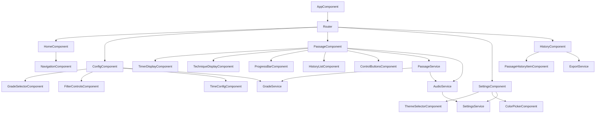

# Components

# GradeService

**Responsibility:** Chargement et parsing des fichiers JSON (nomenclature.json, videos.json), gestion de la logique de génération de passages selon les grades et filtres

**Key Interfaces:**
- `loadNomenclature(): Observable<NomenclatureData>` - Charge nomenclature.json
- `loadVideos(): Observable<VideosData>` - Charge videos.json
- `getTechniquesForGrade(grade: string, filters: PassageFilters): Technique[]` - Récupère les techniques selon grade et filtres
- `validateGrade(grade: string): boolean` - Valide qu'un grade existe

**Dependencies:** HttpClient Angular pour charger les fichiers JSON

**Technology Stack:** Angular Service, RxJS Observables, TypeScript

## PassageService

**Responsibility:** Gestion de l'état du passage en cours (techniques, timer, progression), logique de génération aléatoire respectant l'ordre strict traditionnel

**Key Interfaces:**
- `generatePassage(grade: string, filters: PassageFilters, config: PassageConfig): Passage` - Génère un passage aléatoire
- `startPassage(passage: Passage): void` - Démarre l'exécution d'un passage
- `pausePassage(): void` - Met en pause
- `resumePassage(): void` - Reprend
- `getCurrentTechnique(): Technique | null` - Récupère la technique en cours
- `getPassageState(): Observable<PassageState>` - État réactif du passage

**Dependencies:** GradeService pour récupérer les techniques, AudioService pour les annonces

**Technology Stack:** Angular Service, RxJS BehaviorSubject, TypeScript

## AudioService

**Responsibility:** Gestion de la lecture audio (audios locaux et option Elevenlabs), contrôle de la lecture, pause, répétition

**Key Interfaces:**
- `playTechnique(technique: Technique, voice: 'masculin' | 'féminin'): Promise<void>` - Joue l'annonce audio
- `pauseAudio(): void` - Met en pause
- `resumeAudio(): void` - Reprend
- `repeatLastTechnique(): void` - Répète la dernière technique
- `useElevenlabs(apiKey: string): void` - Active l'utilisation de Elevenlabs

**Dependencies:** SettingsService pour la voix par défaut, fichiers audio dans assets/

**Technology Stack:** Angular Service, Web Audio API, Fetch API (pour Elevenlabs)

## SettingsService

**Responsibility:** Gestion des réglages utilisateur (thème, couleurs, voix), persistance dans localStorage

**Key Interfaces:**
- `getSettings(): Observable<UserSettings>` - Récupère les réglages
- `updateSettings(settings: Partial<UserSettings>): void` - Met à jour les réglages
- `resetSettings(): void` - Réinitialise aux valeurs par défaut
- `applyTheme(theme: 'clair' | 'sombre'): void` - Applique le thème

**Dependencies:** localStorage API, CSS Variables pour application des couleurs

**Technology Stack:** Angular Service, RxJS BehaviorSubject, localStorage API

## ExportService

**Responsibility:** Génération du fichier .txt avec les techniques et liens vidéo

**Key Interfaces:**
- `exportPassage(passage: Passage): void` - Génère et télécharge le fichier .txt
- `formatPassageText(passage: Passage): string` - Formate le texte du passage

**Dependencies:** Passage pour les données, VideosData pour les liens vidéo

**Technology Stack:** Angular Service, Blob API, File Download API

## Component Diagrams

---
