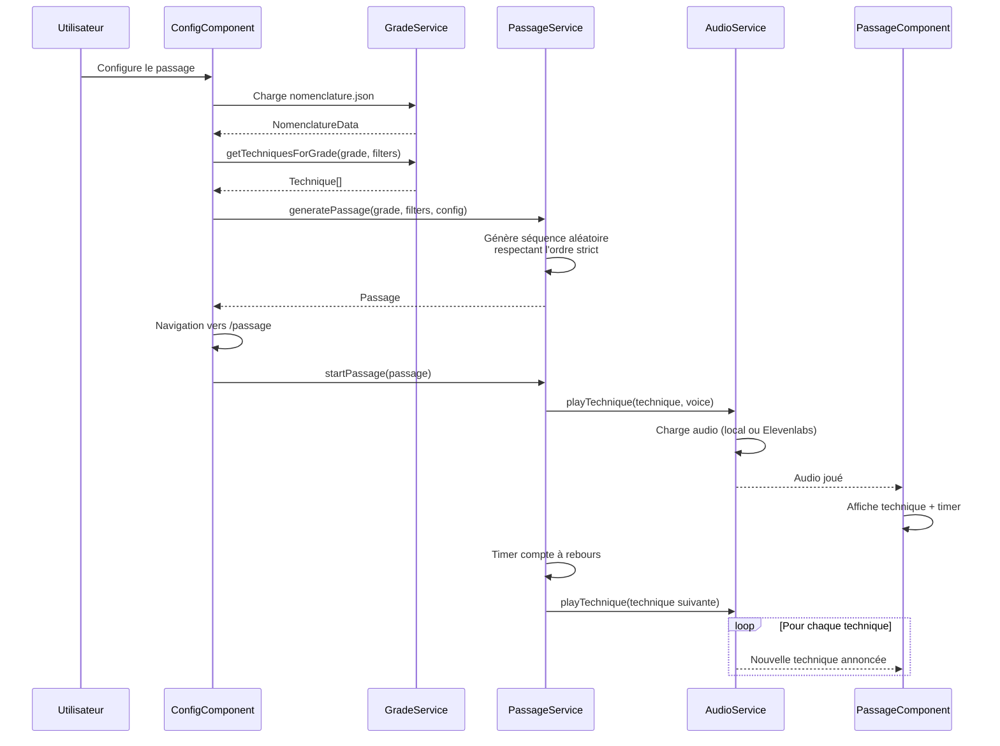
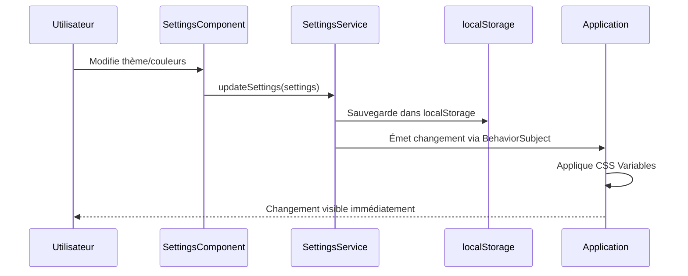

# Core Workflows

# Workflow 1: Génération et Démarrage d'un Passage

```mermaid
sequenceDiagram
    participant U as Utilisateur
    participant C as ConfigComponent
    participant GS as GradeService
    participant PS as PassageService
    participant AS as AudioService
    participant PC as PassageComponent
    
    U->>C: Configure le passage
    C->>GS: Charge nomenclature.json
    GS-->>C: NomenclatureData
    C->>GS: getTechniquesForGrade(grade, filters)
    GS-->>C: Technique[]
    C->>PS: generatePassage(grade, filters, config)
    PS->>PS: Génère séquence aléatoire<br/>respectant l'ordre strict
    PS-->>C: Passage
    C->>C: Navigation vers /passage
    C->>PS: startPassage(passage)
    PS->>AS: playTechnique(technique, voice)
    AS->>AS: Charge audio (local ou Elevenlabs)
    AS-->>PC: Audio joué
    PC->>PC: Affiche technique + timer
    PS->>PS: Timer compte à rebours
    PS->>AS: playTechnique(technique suivante)
    loop Pour chaque technique
        AS-->>PC: Nouvelle technique annoncée
    end
```

## Workflow 2: Gestion des Réglages

```mermaid
sequenceDiagram
    participant U as Utilisateur
    participant S as SettingsComponent
    participant SS as SettingsService
    participant LS as localStorage
    participant App as Application
    
    U->>S: Modifie thème/couleurs
    S->>SS: updateSettings(settings)
    SS->>LS: Sauvegarde dans localStorage
    SS->>App: Émet changement via BehaviorSubject
    App->>App: Applique CSS Variables
    App-->>U: Changement visible immédiatement
```

---
