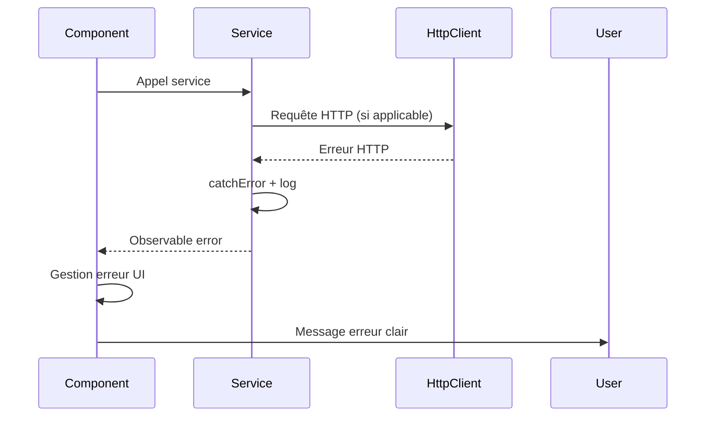

# Error Handling Strategy

# Error Flow



## Error Response Format

```typescript
interface ApiError {
  error: {
    code: string;
    message: string;
    details?: Record<string, any>;
    timestamp: string;
  };
}
```

**Note:** Pour cette application frontend-only, les erreurs sont principalement:
- Erreurs de chargement JSON
- Erreurs de chargement audio
- Erreurs localStorage (quota)
- Erreurs API Elevenlabs

## Frontend Error Handling

```typescript
// Exemple dans un service
loadNomenclature(): Observable<NomenclatureData> {
  return this.http.get<NomenclatureData>('assets/data/nomenclature.json').pipe(
    catchError(error => {
      console.error('Error loading nomenclature:', error);
      // Afficher message utilisateur
      this.showError('Impossible de charger les données. Veuillez recharger la page.');
      return throwError(() => error);
    })
  );
}
```

## Backend Error Handling

**N/A - Pas de backend**

---
