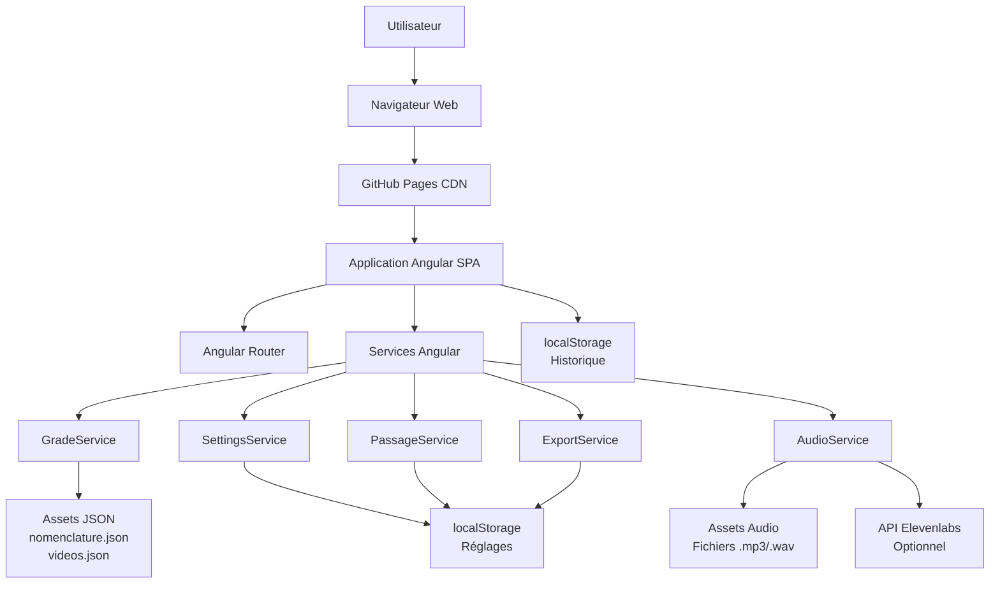

# High Level Architecture

# Technical Summary

**Keiko Hub** est une application web Angular SPA (Single Page Application) déployée comme site statique sur GitHub Pages. L'architecture est entièrement côté client, sans backend ni serveur. L'application utilise Angular avec RxJS pour la gestion d'état réactive, charge des fichiers JSON statiques depuis les assets pour les données des grades et vidéos, et utilise localStorage pour la persistance des réglages utilisateur et de l'historique. L'intégration optionnelle avec l'API Elevenlabs pour la synthèse vocale se fait directement depuis le navigateur. Cette architecture simple et légère répond aux objectifs du PRD : application gratuite, accessible, fonctionnant sans infrastructure serveur, et optimisée pour une utilisation mobile pendant l'entraînement physique.

## Platform and Infrastructure Choice

**Platform:** GitHub Pages (Static Site Hosting)

**Key Services:**
- **GitHub Pages:** Hébergement statique gratuit pour l'application Angular compilée
- **GitHub Actions (optionnel):** CI/CD pour build et déploiement automatique
- **GitHub Repository:** Version control et collaboration

**Deployment Host and Regions:** GitHub Pages CDN global (multi-régions automatiques)

**Rationale:**
- **Budget zéro:** GitHub Pages est gratuit pour les repositories publics
- **Simplicité:** Pas d'infrastructure complexe nécessaire pour une SPA statique
- **Performance:** CDN global de GitHub pour distribution rapide
- **Intégration:** Workflow Git simple pour déploiement
- **HTTPS:** Certificat SSL automatique inclus

**Alternatives considérées:**
- **Vercel/Netlify:** Offrent des fonctionnalités similaires mais GitHub Pages est suffisant et déjà intégré au workflow Git
- **AWS S3 + CloudFront:** Trop complexe et coûteux pour cette application simple

## Repository Structure

**Structure:** Monorepo Angular standard (pas de monorepo tool externe nécessaire)

**Monorepo Tool:** N/A - Structure Angular standard suffisante

**Package Organization:**
```
keiko-hub/
├── src/                          # Code source Angular
│   ├── app/                      # Application principale
│   │   ├── components/          # Composants UI
│   │   ├── pages/               # Pages/Composants de route
│   │   ├── services/            # Services Angular
│   │   ├── models/              # Interfaces TypeScript
│   │   ├── guards/              # Route guards (si nécessaire)
│   │   ├── interceptors/         # HTTP interceptors (si nécessaire)
│   │   └── utils/               # Utilitaires
│   ├── assets/                  # Assets statiques
│   │   ├── data/                # Fichiers JSON (nomenclature.json, videos.json)
│   │   ├── audio/               # Fichiers audio pré-enregistrés
│   │   └── images/              # Images (logo, etc.)
│   ├── styles/                  # Styles globaux
│   └── environments/            # Configuration par environnement
├── docs/                         # Documentation
│   ├── prd.md
│   ├── front-end-spec.md
│   └── architecture.md
├── e2e/                          # Tests E2E (optionnel pour MVP)
├── angular.json                  # Configuration Angular
├── package.json                  # Dépendances
└── tsconfig.json                 # Configuration TypeScript
```

**Rationale:** Structure Angular standard, simple et maintenable. Pas besoin de monorepo tool complexe pour une application SPA unique. La structure est claire et suit les conventions Angular.

## High Level Architecture Diagram



## Architectural Patterns

- **SPA (Single Page Application):** Application Angular avec routing côté client - _Rationale:_ Expérience utilisateur fluide, navigation rapide sans rechargements de page, idéal pour une application interactive
- **Component-Based Architecture:** Composants Angular réutilisables et modulaires - _Rationale:_ Maintenabilité, réutilisabilité, séparation des responsabilités, facilité de test
- **Service-Oriented Architecture (Frontend):** Services Angular pour la logique métier - _Rationale:_ Séparation claire entre logique métier et présentation, services réutilisables, testabilité
- **Reactive State Management:** RxJS BehaviorSubject pour l'état réactif - _Rationale:_ Communication réactive entre composants, gestion d'état centralisée sans complexité de NgRx, adapté à la taille de l'application
- **Static Asset Loading:** Chargement asynchrone des fichiers JSON et audio depuis assets - _Rationale:_ Pas de backend nécessaire, données statiques, performance optimale avec cache navigateur
- **Client-Side Persistence:** localStorage pour réglages et historique - _Rationale:_ Pas de backend nécessaire, persistance locale, simple et efficace pour les besoins de l'application

---
