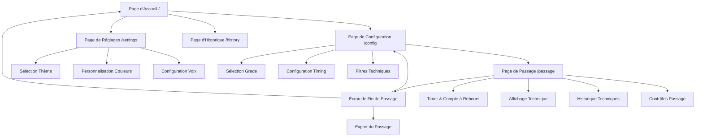
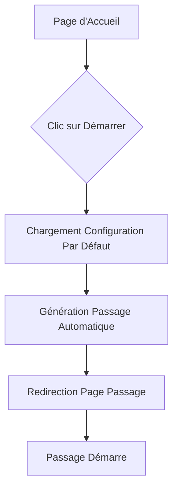
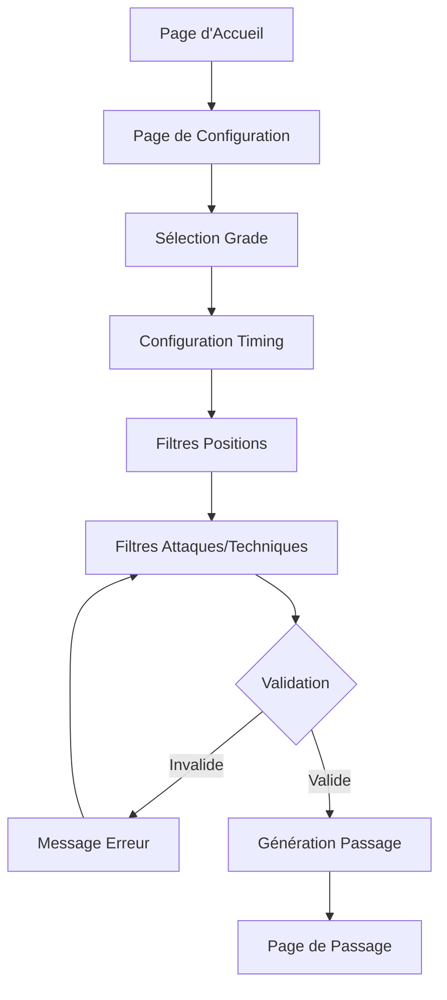
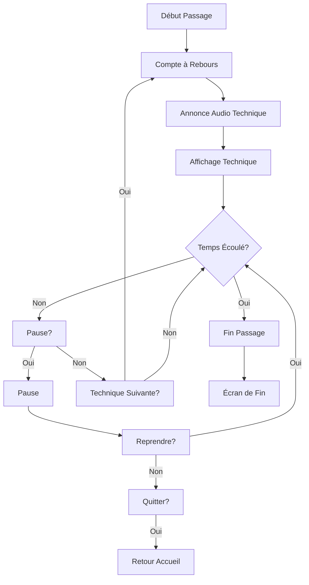
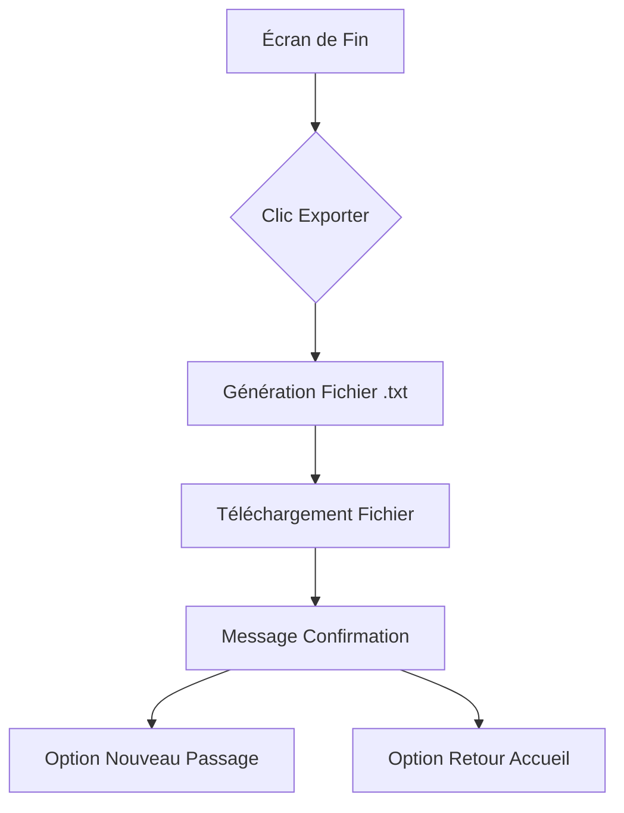
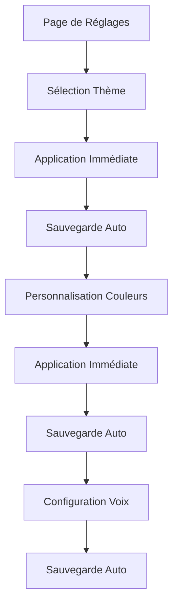

# Keiko Hub UI/UX Specification

**Version:** 1.0  
**Date:** 2024-12-19  
**Auteur:** UX Expert (Sally)

---

## Introduction

Ce document définit les objectifs d'expérience utilisateur, l'architecture de l'information, les flux utilisateur, et les spécifications de design visuel pour l'interface utilisateur de **Keiko Hub**. Il sert de fondation pour le design visuel et le développement frontend, garantissant une expérience cohérente et centrée sur l'utilisateur.

---

## Overall UX Goals & Principles

### Target User Personas

#### Persona Principal: Aïkidoka Préparant un Passage de Grade

**Profil:**
- Pratiquants d'Aïkido de tous âges (adolescents à seniors)
- Niveaux: 6e Kyū à 5e Dan
- Contexte d'utilisation: Dojos, entraînement à domicile, pratique individuelle
- Fréquence d'utilisation: Régulière pendant la période de préparation (plusieurs fois par semaine)

**Besoins spécifiques:**
- Simulation réaliste d'un passage de grade
- Flexibilité pour s'entraîner seul
- Personnalisation selon les points à travailler
- Accès rapide et interface simple
- Utilisation mobile pendant l'entraînement physique

**Objectifs:**
- Réussir leur passage de grade
- Améliorer leur mémorisation des techniques
- S'entraîner de manière autonome
- Gagner en confiance avant l'examen

#### Persona Secondaire: Professeur d'Aïkido

**Profil:**
- Instructeurs et sensei
- Responsables de préparation aux passages de grade
- Utilisation occasionnelle pour recommander l'outil

**Besoins:**
- Outil simple à recommander
- Interface claire et professionnelle
- Fiabilité et cohérence avec la tradition Aïkido

### Usability Goals

1. **Ease of learning:** Nouveaux utilisateurs peuvent démarrer un passage de grade en moins de 10 secondes sans formation
2. **Efficiency of use:** Utilisateurs expérimentés peuvent configurer un passage personnalisé en moins de 30 secondes
3. **Error prevention:** Validation claire des configurations avant génération, messages d'erreur compréhensibles
4. **Memorability:** Interface intuitive permettant aux utilisateurs occasionnels de revenir sans réapprendre
5. **Accessibility:** Conformité WCAG AA pour garantir l'accessibilité pendant l'entraînement physique (visibilité variable, utilisation debout)

### Design Principles

1. **Simplicité avant tout** - Interface épurée avec un minimum d'éléments visuels pendant le passage, élimination des distractions
2. **Accessibilité immédiate** - Mode "démarrage rapide" permettant de commencer en un clic, configuration par défaut intelligente
3. **Immersion totale** - Mode plein écran pour éliminer toutes les distractions pendant l'entraînement
4. **Feedback visuel clair** - Indicateurs visuels immédiats (timer, compte à rebours, progression) pour guider l'utilisateur
5. **Personnalisation discrète** - Options de personnalisation disponibles mais non intrusives, sauvegarde automatique
6. **Optimisation mobile-first** - Conçue pour être utilisée debout avec un téléphone/tablette pendant l'entraînement physique
7. **Respect de la tradition** - Design inspiré de l'esthétique japonaise (simplicité, élégance) reflétant les valeurs Aïkido

### Change Log

| Date | Version | Description | Author |
|------|---------|-------------|--------|
| 2024-12-19 | 1.0 | Création initiale de la spécification front-end | Sally (UX Expert) |

---

## Information Architecture (IA)

### Site Map / Screen Inventory

### Navigation Structure

**Primary Navigation:**
- Header fixe avec logo Keiko Hub et menu principal
- Liens vers: Accueil, Configuration, Réglages, Historique
- Accessible sur toutes les pages sauf pendant le passage en mode plein écran
- Design minimaliste avec icônes + texte pour clarté

**Secondary Navigation:**
- Breadcrumbs optionnels sur les pages de configuration et réglages pour indiquer le chemin
- Navigation contextuelle dans la page de passage (retour, pause, plein écran)

**Breadcrumb Strategy:**
- Utilisation discrète sur les pages de configuration et réglages
- Format: Accueil > Configuration ou Accueil > Réglages
- Non affiché sur la page d'accueil et la page de passage (interface épurée)

---

## User Flows

### Flow 1: Démarrage Rapide

**User Goal:** Démarrer un passage de grade rapidement avec la configuration par défaut

**Entry Points:**
- Page d'accueil (bouton "Démarrer" principal)

**Success Criteria:**
- Utilisateur clique sur "Démarrer" et arrive sur la page de passage en moins de 10 secondes
- Configuration par défaut intelligente appliquée (derniers réglages ou valeurs par défaut)

**Flow Diagram:**

**Edge Cases & Error Handling:**
- Si les données JSON ne sont pas chargées: Afficher message d'erreur avec option de recharger
- Si aucun grade n'est sélectionnable: Rediriger vers page de configuration
- Si génération échoue: Afficher message d'erreur avec suggestion de modifier les filtres

**Notes:** Ce flow est le plus important car il répond au besoin principal d'accessibilité immédiate. La configuration par défaut doit être intelligente (utiliser les derniers réglages sauvegardés ou des valeurs sensées).

### Flow 2: Configuration Personnalisée

**User Goal:** Configurer un passage personnalisé avec filtres spécifiques

**Entry Points:**
- Page d'accueil (lien "Configuration avancée")
- Page de configuration directe (/config)
- Bouton "Nouveau passage" après un passage terminé

**Success Criteria:**
- Utilisateur peut sélectionner grade, timing, filtres, et générer un passage
- Validation claire avant génération
- Redirection vers page de passage avec configuration appliquée

**Flow Diagram:**

**Edge Cases & Error Handling:**
- Si aucun filtre ne correspond: Message clair expliquant qu'aucune technique ne correspond, suggestion de modifier les filtres
- Si durée configurée trop courte: Avertissement mais permet la génération
- Si configuration invalide: Messages d'erreur contextuels près des champs concernés

**Notes:** La page de configuration doit être organisée logiquement avec sections claires. Les filtres avancés peuvent être masqués par défaut avec option d'expansion.

### Flow 3: Exécution d'un Passage

**User Goal:** Suivre et exécuter un passage de grade généré

**Entry Points:**
- Après génération depuis page de configuration
- Après démarrage rapide depuis page d'accueil

**Success Criteria:**
- Passage se déroule avec annonces audio synchronisées
- Utilisateur peut suivre la progression clairement
- Contrôles (pause, répéter) accessibles et fonctionnels

**Flow Diagram:**

**Edge Cases & Error Handling:**
- Si audio ne charge pas: Fallback vers affichage visuel uniquement, message discret
- Si passage interrompu (fermeture navigateur): Option de reprendre (si localStorage permet)
- Si erreur de synchronisation: Réinitialisation automatique du timer

**Notes:** Ce flow est critique car c'est le cœur de l'application. L'interface doit être ultra-épurée pendant le passage pour permettre la concentration sur l'exécution physique.

### Flow 4: Export et Partage

**User Goal:** Exporter un passage terminé pour révision ou partage

**Entry Points:**
- Écran de fin de passage (bouton "Exporter")
- Page d'historique (réexport d'un passage précédent)

**Success Criteria:**
- Fichier .txt généré et téléchargé avec toutes les techniques et liens vidéo
- Message de confirmation affiché
- Fichier nommé de manière descriptive

**Flow Diagram:**

**Edge Cases & Error Handling:**
- Si génération échoue: Message d'erreur avec option de réessayer
- Si navigateur bloque téléchargement: Instructions pour autoriser les téléchargements

**Notes:** L'export doit être rapide et le fichier bien formaté pour faciliter la révision.

### Flow 5: Personnalisation des Réglages

**User Goal:** Personnaliser l'apparence et les préférences de l'application

**Entry Points:**
- Navigation principale (lien "Réglages")
- Page d'accueil (lien discret vers réglages)

**Success Criteria:**
- Changements appliqués immédiatement sans rechargement
- Sauvegarde automatique dans localStorage
- Aperçu en temps réel des modifications

**Flow Diagram:**

**Edge Cases & Error Handling:**
- Si localStorage plein: Message d'avertissement, suggestion de supprimer l'historique
- Si couleur invalide: Validation en temps réel avec message d'erreur

**Notes:** Les réglages doivent être persistants et appliqués globalement à toute l'application.

---

## Wireframes & Mockups

### Design Files

**Primary Design Files:** À créer dans Figma ou outil de design préféré. Les wireframes détaillés seront créés lors de la phase de design visuel.

**Référence:** Ce document sert de spécification fonctionnelle. Les maquettes visuelles détaillées seront créées séparément.

### Key Screen Layouts

#### Screen 1: Page d'Accueil

**Purpose:** Point d'entrée principal avec accès rapide au démarrage

**Key Elements:**
- Logo Keiko Hub centré et visible
- Gros bouton "Démarrer" (CTA principal, minimum 60px de hauteur)
- Lien discret vers réglages (coin supérieur)
- Message de bienvenue simple et épuré
- Design minimaliste inspiré esthétique japonaise

**Interaction Notes:**
- Clic sur "Démarrer" → Génération automatique avec config par défaut → Redirection vers /passage
- Clic sur réglages → Navigation vers /settings
- Design responsive avec bouton toujours accessible

**Design File Reference:** À créer

#### Screen 2: Page de Configuration

**Purpose:** Permettre la configuration complète d'un passage personnalisé

**Key Elements:**
- Section "Grade" en haut (sélection claire)
- Section "Timing" (temps entre techniques, durée totale)
- Section "Audio" (sélection voix)
- Section "Filtres" (positions, attaques, techniques) - peut être expandable
- Bouton "Générer le passage" bien visible en bas (sticky sur mobile)
- Organisation en sections logiques avec espacement généreux

**Interaction Notes:**
- Validation en temps réel des champs
- Messages d'erreur contextuels
- Aperçu du nombre de techniques qui seront générées (si possible)
- Bouton génération désactivé si configuration invalide

**Design File Reference:** À créer

#### Screen 3: Page de Passage

**Purpose:** Interface principale pendant l'exécution du passage

**Key Elements:**
- Timer en haut (grand, lisible, format MM:SS)
- Compte à rebours visuel (cercle animé ou barre) au centre avant chaque technique
- Attaque et technique en cours (texte très grand, centré, minimum 48px mobile)
- Indicateur "Technique X sur Y" (visible mais discret)
- Barre de progression horizontale (animée)
- Historique des techniques (sidebar ou section scrollable, peut être masqué sur mobile)
- Boutons de contrôle (Pause, Répéter) bien visibles mais non intrusifs
- Bouton plein écran (icône discrète)

**Interaction Notes:**
- Interface ultra-épurée pendant le passage
- Transitions fluides entre techniques (fade in/out)
- Raccourcis clavier: Espace (pause/reprendre), R (répéter)
- Mode plein écran élimine toutes distractions
- Historique peut être masqué/affiché sur mobile

**Design File Reference:** À créer

#### Screen 4: Écran de Fin de Passage

**Purpose:** Confirmer la fin du passage et offrir les actions suivantes

**Key Elements:**
- Message de félicitations/completion (grand et encourageant)
- Résumé du passage (nombre de techniques, durée totale)
- Bouton "Exporter" bien visible (CTA principal)
- Bouton "Nouveau passage" (CTA secondaire)
- Bouton "Retour à l'accueil" (lien discret)

**Interaction Notes:**
- Affichage en modal ou écran dédié selon le contexte
- Export génère et télécharge immédiatement le fichier .txt
- Options claires pour les prochaines actions

**Design File Reference:** À créer

#### Screen 5: Page de Réglages

**Purpose:** Permettre la personnalisation de l'apparence et des préférences

**Key Elements:**
- Section "Apparence" (thème clair/sombre avec toggle)
- Section "Couleurs" (color pickers pour bannière et footer)
- Section "Audio" (sélection voix par défaut)
- Aperçu en temps réel des changements
- Sauvegarde automatique (pas de bouton "Sauvegarder")

**Interaction Notes:**
- Changements appliqués immédiatement
- Color pickers avec validation de contraste (WCAG AA)
- Toggle thème avec transition fluide
- Retour automatique aux valeurs par défaut si nécessaire

**Design File Reference:** À créer

#### Screen 6: Page d'Historique

**Purpose:** Afficher et gérer l'historique des passages précédents

**Key Elements:**
- Liste des passages (triés par date, plus récents en premier)
- Informations par passage: date, grade, durée, nombre de techniques
- Actions par passage: voir détails, réexporter, régénérer similaire
- Message si historique vide
- Filtrage/recherche optionnel

**Interaction Notes:**
- Clic sur un passage → voir détails complets
- Bouton réexport → génère et télécharge le fichier .txt
- Bouton régénérer → redirige vers /config avec configuration similaire

**Design File Reference:** À créer

---

## Component Library / Design System

### Design System Approach

**Approche:** Design system personnalisé inspiré de l'esthétique japonaise minimaliste, adapté spécifiquement pour Keiko Hub. Pas d'utilisation d'un framework CSS externe (comme Material, Bootstrap) pour garder le contrôle total sur le design et la performance.

**Rationale:** 
- Design unique reflétant les valeurs Aïkido (simplicité, élégance)
- Performance optimale (pas de CSS inutile)
- Personnalisation complète des couleurs par l'utilisateur
- Cohérence visuelle avec le branding Keiko Hub

### Core Components

#### Component 1: Button (Bouton)

**Purpose:** Élément interactif principal pour les actions

**Variants:**
- Primary: Bouton principal (ex: "Démarrer", "Générer le passage") - couleur accent, grand, visible
- Secondary: Bouton secondaire (ex: "Nouveau passage") - style discret
- Tertiary: Lien bouton (ex: "Retour à l'accueil") - style texte avec hover

**States:**
- Default: État normal
- Hover: Feedback visuel clair
- Active: État pressé
- Disabled: Désactivé (configuration invalide)
- Loading: État de chargement (génération en cours)

**Usage Guidelines:**
- Zones tactiles minimum 44x44px sur mobile
- Contraste WCAG AA pour tous les états
- Transitions fluides entre états
- Feedback immédiat au clic

#### Component 2: Timer Display

**Purpose:** Afficher le temps écoulé pendant le passage

**Variants:**
- Format MM:SS pour le timer principal
- Format SS pour le compte à rebours

**States:**
- Running: Timer actif (couleur normale)
- Paused: Timer en pause (couleur atténuée ou icône pause)
- Finished: Timer terminé (couleur de completion)

**Usage Guidelines:**
- Taille très grande pour lisibilité à distance (minimum 48px mobile)
- Police monospace pour alignement des chiffres
- Animation fluide des changements de secondes
- Contraste élevé pour visibilité

#### Component 3: Progress Bar

**Purpose:** Indiquer visuellement la progression du passage

**Variants:**
- Horizontal: Barre horizontale pour progression générale
- Circular: Cercle pour compte à rebours (optionnel)

**States:**
- Empty: Début (0%)
- Filling: En cours (animation fluide)
- Complete: Terminé (100%)

**Usage Guidelines:**
- Animation fluide lors des mises à jour (60 FPS)
- Couleur distincte pour progression
- Accessible (texte alternatif ou aria-label)

#### Component 4: Technique Display

**Purpose:** Afficher l'attaque et la technique en cours

**Variants:**
- Large: Affichage principal pendant le passage (très grand)
- Compact: Affichage dans l'historique (taille normale)

**States:**
- Current: Technique en cours (mise en évidence)
- Previous: Techniques précédentes (style normal)
- Upcoming: Technique suivante (optionnel, style discret)

**Usage Guidelines:**
- Texte très grand pour lisibilité (minimum 48px mobile, plus grand sur desktop)
- Séparation claire entre attaque et technique
- Contraste maximal pour visibilité
- Transition fluide entre techniques (fade in/out)

#### Component 5: Filter Controls

**Purpose:** Permettre la sélection de filtres pour la génération

**Variants:**
- Checkbox: Pour sélection multiple (positions)
- Radio: Pour sélection unique (grade, voix)
- Multi-select: Pour sélection multiple avec recherche (attaques, techniques)
- Toggle: Pour on/off (armes, Randori)

**States:**
- Unselected: Non sélectionné
- Selected: Sélectionné
- Disabled: Désactivé (selon contexte, ex: Bokken si grade < 3e Dan)
- Hover: Feedback visuel

**Usage Guidelines:**
- Labels clairs et descriptifs
- Groupement logique des options
- Validation visuelle des sélections
- Messages d'aide contextuels si nécessaire

#### Component 6: Color Picker

**Purpose:** Permettre la personnalisation des couleurs

**Variants:**
- Standard: Color picker HTML5 natif
- Custom: Interface personnalisée si nécessaire

**States:**
- Default: Couleur actuelle affichée
- Active: Color picker ouvert
- Invalid: Couleur ne respectant pas le contraste (avertissement)

**Usage Guidelines:**
- Aperçu en temps réel de la couleur
- Validation de contraste WCAG AA
- Option de réinitialiser aux valeurs par défaut
- Sauvegarde automatique

#### Component 7: History List Item

**Purpose:** Afficher un passage dans l'historique

**Variants:**
- Default: Affichage standard avec informations de base
- Expanded: Affichage détaillé avec liste des techniques

**States:**
- Default: État normal
- Hover: Mise en évidence
- Selected: Passage sélectionné (pour actions)

**Usage Guidelines:**
- Informations claires et organisées
- Actions accessibles (réexport, régénérer)
- Design responsive (adaptation mobile/desktop)

---

## Branding & Style Guide

### Visual Identity

**Brand Guidelines:** Keiko Hub - Application d'entraînement aux passages de grade Aïkido

**Style général:**
- Design épuré et minimaliste, inspiré de l'esthétique japonaise (simplicité, élégance)
- Logo Keiko Hub fourni dans le code source (à intégrer dans l'interface)
- Couleurs personnalisables par l'utilisateur (bannière, footer) tout en conservant l'identité de base
- Typographie claire et lisible (sans-serif moderne pour la lisibilité)

**Éléments de style:**
- Transitions fluides et douces (inspirées des mouvements Aïkido)
- Animations subtiles et non distrayantes
- Espacement généreux pour la clarté visuelle
- Hiérarchie visuelle claire (éléments importants en grand, secondaires plus petits)

### Color Palette

| Color Type | Hex Code | Usage |
|------------|----------|-------|
| Primary | Personnalisable (bannière) | Couleur principale de la bannière, personnalisable par l'utilisateur |
| Secondary | Personnalisable (footer) | Couleur du footer, personnalisable par l'utilisateur |
| Accent | Défini par thème | Couleurs d'accent pour boutons primaires, éléments interactifs |
| Success | #4CAF50 (clair) / #66BB6A (sombre) | Feedback positif, confirmations, completion |
| Warning | #FF9800 (clair) / #FFA726 (sombre) | Cautions, avertissements importants |
| Error | #F44336 (clair) / #EF5350 (sombre) | Erreurs, actions destructives |
| Neutral | Défini par thème | Texte, bordures, arrière-plans |

**Thèmes:**
- **Thème clair:** Fond clair (#FFFFFF ou #F5F5F5), texte sombre (#212121 ou #424242), couleurs douces
- **Thème sombre:** Fond sombre (#121212 ou #1E1E1E), texte clair (#FFFFFF ou #E0E0E0), couleurs moins saturées
- **Transition:** Fluide entre les thèmes (CSS transitions)

**Note:** Les couleurs primaires et secondaires sont personnalisables par l'utilisateur via les color pickers dans les réglages. Les couleurs d'accent, success, warning, error s'adaptent au thème sélectionné.

### Typography

#### Font Families

- **Primary:** Sans-serif moderne (ex: Inter, Roboto, ou système par défaut) - pour tout le texte principal
- **Secondary:** Même famille que primary (pas de font secondaire nécessaire)
- **Monospace:** Pour le timer et les nombres (ex: 'Courier New', monospace) - pour alignement parfait des chiffres

**Rationale:** Police sans-serif pour lisibilité maximale, surtout sur mobile pendant l'entraînement. Monospace pour le timer pour garantir l'alignement des chiffres.

#### Type Scale

| Element | Size | Weight | Line Height |
|---------|------|--------|-------------|
| H1 | 2.5rem (40px) | 700 (Bold) | 1.2 |
| H2 | 2rem (32px) | 600 (Semi-bold) | 1.3 |
| H3 | 1.5rem (24px) | 600 (Semi-bold) | 1.4 |
| Body | 1rem (16px) | 400 (Regular) | 1.5 |
| Small | 0.875rem (14px) | 400 (Regular) | 1.4 |
| Technique Display | 3rem+ (48px+) | 600 (Semi-bold) | 1.2 |

**Note:** La taille "Technique Display" est spécifique pour l'affichage des techniques pendant le passage et doit être très grande pour lisibilité à distance.

### Iconography

**Icon Library:** À définir (peut utiliser une bibliothèque d'icônes comme Feather Icons, Heroicons, ou icônes personnalisées)

**Usage Guidelines:**
- Style cohérent (ligne fine, minimaliste)
- Taille appropriée (24px standard, 32px pour icônes importantes)
- Contraste suffisant pour visibilité
- Alternatives textuelles pour accessibilité
- Utilisation pour: navigation, contrôles (pause, répéter, plein écran), indicateurs d'état

### Spacing & Layout

**Grid System:**
- Pas de grid system complexe nécessaire
- Utilisation de Flexbox et CSS Grid natif pour layouts simples
- Marges et paddings cohérents basés sur une échelle de 8px

**Spacing Scale:**
- Base: 8px
- Échelle: 8px, 16px, 24px, 32px, 48px, 64px
- Utilisation: Marges entre sections (32px-48px), espacement interne des composants (16px-24px), espacement généreux pour clarté

**Layout Principles:**
- Centrage du contenu principal
- Espacement généreux pour éviter la surcharge visuelle
- Hiérarchie claire avec espacement variable (plus d'espace autour des éléments importants)

---

## Accessibility Requirements

### Compliance Target

**Standard:** WCAG 2.1 Level AA (conformité minimale requise)

**Rationale:** WCAG AA est nécessaire pour garantir une accessibilité de base, surtout pour une application utilisée pendant l'entraînement physique où la visibilité peut varier. WCAG AAA n'est pas requis pour le MVP mais peut être un objectif futur.

### Key Requirements

**Visual:**
- Color contrast ratios: Minimum 4.5:1 pour le texte normal, 3:1 pour le texte large (18pt+ ou 14pt+ bold)
- Focus indicators: Indicateurs de focus clairs et visibles (outline 2px minimum, contraste suffisant)
- Text sizing: Texte redimensionnable jusqu'à 200% sans perte de fonctionnalité

**Interaction:**
- Keyboard navigation: Tous les éléments interactifs accessibles au clavier (Tab, Enter, Espace)
- Screen reader support: Support basique des lecteurs d'écran pour les éléments critiques (labels, états, messages)
- Touch targets: Minimum 44x44 pixels pour tous les éléments interactifs sur mobile

**Content:**
- Alternative text: Textes alternatifs pour les éléments non-textuels importants (icônes, images si ajoutées)
- Heading structure: Hiérarchie de titres logique (h1, h2, h3) pour navigation par lecteur d'écran
- Form labels: Labels clairs et associés à tous les champs de formulaire

**Additional:**
- Réduction de mouvement: Respecter la préférence `prefers-reduced-motion` pour les animations
- États d'erreur: Messages d'erreur clairs et associés aux champs concernés
- États de chargement: Indicateurs de chargement accessibles

### Testing Strategy

**Approche:**
1. **Tests manuels:** Navigation au clavier, vérification des contrastes, tests avec lecteur d'écran basique
2. **Outils automatisés:** Utilisation d'outils comme axe DevTools, WAVE, ou Lighthouse pour détecter les problèmes
3. **Tests utilisateurs:** Tests avec utilisateurs ayant des besoins d'accessibilité si possible

**Outils recommandés:**
- axe DevTools (extension navigateur)
- WAVE (Web Accessibility Evaluation Tool)
- Lighthouse (audit accessibilité)
- Tests manuels avec lecteur d'écran (NVDA, JAWS, VoiceOver)

**Critères de validation:**
- Tous les éléments interactifs accessibles au clavier
- Contraste des couleurs respecté (vérification avec outils)
- Labels et alternatives textuelles présents
- Navigation logique et cohérente

---

## Responsiveness Strategy

### Breakpoints

| Breakpoint | Min Width | Max Width | Target Devices |
|------------|-----------|-----------|----------------|
| Mobile | 0px | 767px | Téléphones (portrait et landscape) |
| Tablet | 768px | 1023px | Tablettes (portrait et landscape) |
| Desktop | 1024px | 1439px | Ordinateurs portables et écrans standard |
| Wide | 1440px | - | Grands écrans desktop |

**Rationale:** Breakpoints standard basés sur les tailles d'écran courantes. Priorité mobile-first avec améliorations progressives.

### Adaptation Patterns

**Layout Changes:**
- **Mobile:** Layout vertical, contenu centré, éléments empilés, navigation hamburger si nécessaire
- **Tablette:** Meilleure utilisation de l'espace horizontal, layout optimisé pour mode landscape, navigation complète visible
- **Desktop:** Layout avec plus d'espace, sidebar pour historique pendant le passage, navigation toujours visible

**Navigation Changes:**
- **Mobile:** Navigation hamburger ou barre de navigation compacte, liens essentiels seulement
- **Tablette/Desktop:** Navigation complète visible, tous les liens accessibles

**Content Priority:**
- **Mobile:** Contenu essentiel en premier (timer, technique en cours), historique masquable
- **Tablette/Desktop:** Plus d'informations visibles simultanément, historique toujours visible si espace disponible

**Interaction Changes:**
- **Mobile:** Grandes zones tactiles (minimum 44x44px), gestes tactiles pour certaines actions
- **Tablette/Desktop:** Zones tactiles appropriées, support des raccourcis clavier, interactions souris optimisées

**Spécificités par page:**
- **Page de Passage:** Optimisation particulière pour mode landscape sur tablette (meilleure utilisation de l'espace horizontal)
- **Page de Configuration:** Layout adaptatif avec sections qui s'empilent sur mobile, côte à côte sur desktop
- **Page d'Historique:** Liste compacte sur mobile, tableau détaillé sur desktop

---

## Animation & Micro-interactions

### Motion Principles

**Principes de mouvement:**
1. **Fluidité:** Toutes les animations doivent être fluides (60 FPS) et naturelles
2. **Subtilité:** Animations discrètes qui ne distraient pas de l'entraînement
3. **Cohérence:** Durées et courbes d'accélération cohérentes dans toute l'application
4. **Accessibilité:** Respecter `prefers-reduced-motion` pour les utilisateurs sensibles au mouvement
5. **Performance:** Optimisation pour maintenir 60 FPS même sur appareils moins puissants

**Inspiration:** Mouvements fluides inspirés des techniques Aïkido (circulaires, doux, contrôlés)

### Key Animations

- **Transition entre techniques:** Fade in/out ou slide doux (Duration: 300ms, Easing: ease-in-out) - Transition fluide entre l'affichage des techniques
- **Compte à rebours:** Animation circulaire ou barre qui se remplit (Duration: variable selon temps configuré, Easing: linear) - Animation visuelle claire du compte à rebours
- **Barre de progression:** Remplissage progressif avec animation fluide (Duration: 200ms, Easing: ease-out) - Mise à jour fluide de la progression
- **Changement de thème:** Transition douce des couleurs (Duration: 300ms, Easing: ease-in-out) - Transition fluide entre thèmes clair/sombre
- **Apparition des éléments:** Fade in léger pour les nouveaux éléments (Duration: 200ms, Easing: ease-out) - Apparition douce des éléments
- **Boutons interactifs:** Scale léger au hover/active (Duration: 150ms, Easing: ease-in-out) - Feedback visuel immédiat
- **Messages d'erreur/succès:** Slide in depuis le haut (Duration: 300ms, Easing: ease-out) - Apparition claire des messages
- **Modal/Écran de fin:** Fade in avec scale léger (Duration: 300ms, Easing: ease-out) - Apparition élégante des modals

**Note:** Toutes les animations utilisent Angular Animations pour garantir la performance et la cohérence.

---

## Performance Considerations

### Performance Goals

- **Page Load:** Chargement initial en moins de 2 secondes sur une connexion internet standard (NFR1)
- **Interaction Response:** Réponse immédiate aux interactions utilisateur (< 100ms pour feedback visuel)
- **Animation FPS:** Maintien de 60 FPS pour toutes les animations et transitions (NFR2)

### Design Strategies

**Optimisations de design:**
1. **Lazy loading:** Chargement à la demande des fichiers audio (pas tous en même temps)
2. **Optimisation des assets:** Compression des fichiers JSON, optimisation des images si ajoutées
3. **Minimisation des animations:** Animations essentielles seulement, pas d'animations superflues
4. **Progressive enhancement:** Contenu essentiel chargé en premier, améliorations progressives
5. **Responsive images:** Si images ajoutées, utilisation de formats optimisés et tailles appropriées
6. **CSS optimisé:** CSS minimal, pas de framework externe lourd, utilisation de CSS natif

**Impact UX:**
- Indicateurs de chargement clairs pendant le chargement initial
- Contenu essentiel visible rapidement (progressive loading)
- Animations fluides qui ne ralentissent pas l'interface
- Feedback immédiat sur toutes les interactions

**Mesures:**
- Tests de performance sur différents appareils (mobile, tablette, desktop)
- Utilisation de Lighthouse pour audit de performance
- Objectif: Score Lighthouse Performance > 80

---

## Next Steps

### Immediate Actions

1. **Review avec stakeholders:** Présenter cette spécification pour validation et feedback
2. **Création des maquettes visuelles:** Créer les wireframes détaillés et maquettes dans Figma (ou outil de design préféré)
3. **Validation des composants:** Confirmer la liste des composants et leurs spécifications détaillées
4. **Préparation pour l'Architect:** Cette spécification est prête pour la création de l'architecture frontend
5. **Questions ouvertes:** Valider les choix de design (bibliothèque d'icônes, polices exactes) si nécessaire

### Design Handoff Checklist

- [x] Tous les flux utilisateur documentés
- [x] Inventaire des composants complet
- [x] Exigences d'accessibilité définies
- [x] Stratégie responsive claire
- [x] Guidelines de branding incorporées
- [x] Objectifs de performance établis
- [ ] Maquettes visuelles créées (à faire dans phase design)
- [ ] Spécifications techniques des composants (sera fait par l'Architect)

---

## Checklist Results

**Note:** Cette section sera complétée si une checklist UI/UX spécifique existe et est exécutée contre ce document.

---

**Document Status:** ✅ **COMPLETE** - Prêt pour review et création des maquettes visuelles

**Next Phase:** Design visuel (wireframes détaillés) → Architecture frontend → Développement
